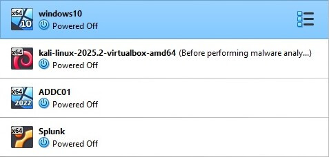
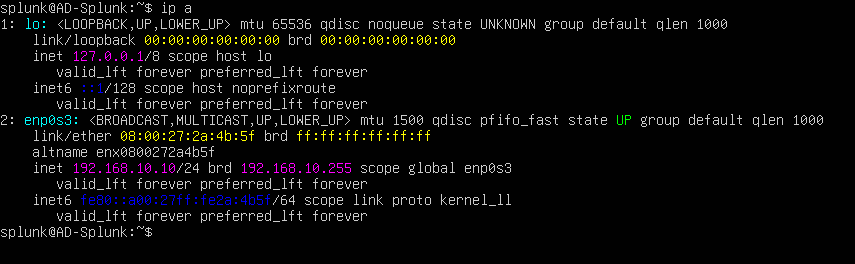
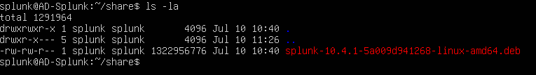
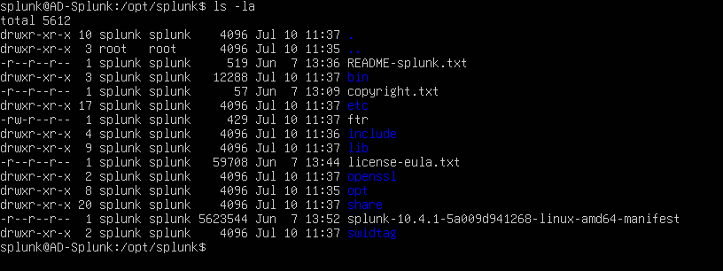
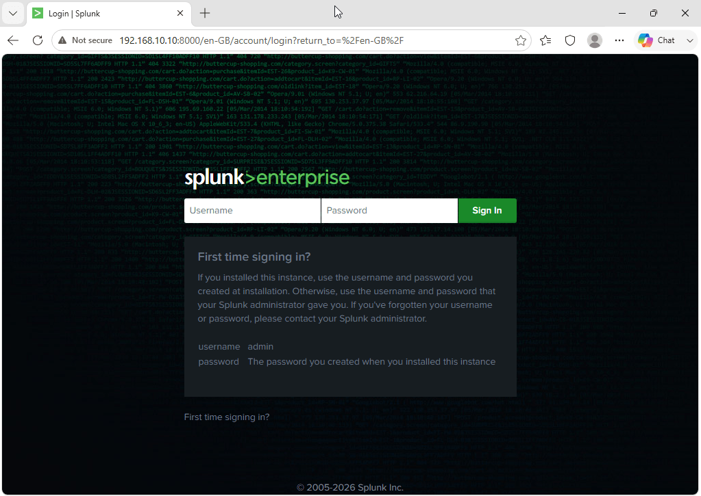
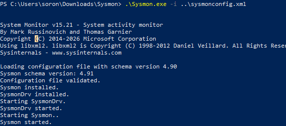
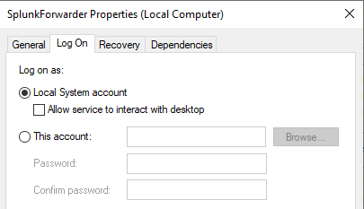
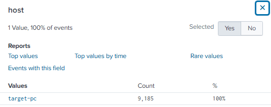
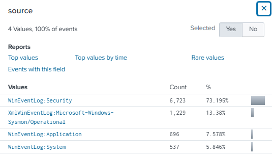

# Active Directory Lab

## Project description

In short, we can think of **Active Directory** as *Database* that contains users, computers, groups and more.
In order to use Active Directory, a server must install a service called **Active Directory Domain Services** (ADDS), and the server must then be promoted to a **Domain controller** (DC), by doing this, it will allows to perform **Authentication** using a protocol called **Kerberos** and **Authorization**.

I will be using:

- Target machine (Windows 10)
- Attacker machine (Kali Linux)
- Active Directory (Windows Server 2022)
- Splunk (Ununtu Server)
- Virtual Box

## Download and install VirtualBox

Go to the [Virtual box download page](https://www.virtualbox.org/wiki/Downloads) and click on **Windows hosts**.


While it’s downloading, go ahead and check the `SHA256 checksums` to verify that the downloaded file has not been altered. To do this, go to your `Downloads` folder (or wherever you saved the installer), open a PowerShell console, and type:

```powershell
    Get-FileHash .\VirtualBox-7.1.10-169112-Win.exe  
```

This will return a SHA256 hash. Copy the hash, go back to the `SHA256 checksums` page on the VirtualBox website, and check if the hash matches one of the listed values (use Ctrl + F and paste the hash to search).

If the hash matches, you can be confident that the file was not altered during download. Now you can proceed with the installation of VirtualBox—just follow the instructions in the setup wizard and you should be good to go.

## Install Windows 10

Go to [this link](https://www.microsoft.com/en-ca/software-download/windows10), scroll down to the **Create Windows 10 installation media** section and click **Download now**. This will download the Media Creation Tool, which will help us create the Windows 10 image file.

Once you run the tool, on the **What do you want to do?** screen, select **Create installation media**, then choose **ISO file**.


After downloading the Windows 10 ISO file, open VirtualBox and create your first virtual machine.

Click on **New**, and the **Create Virtual Machine** wizard will appear. Name the machine `windows10`, select the ISO image, and check the box **Skip unattended installation** — this allows us to install the operating system manually. 

Click **Next** to view the virtual machine specifications.


Note that these settings will depend on your computer's specifications. In this example, I’ll assign **2048 MB** of base memory and **1 CPU** under the processor settings.


For the virtual hard disk, I’ll leave it at **50 GB** and click **Next**.


Next, the wizard will show you a summary of your virtual machine settings. If everything looks good, click **Finish**.

To power on your Windows 10 machine, simply click **Start**. You should now see the Windows 10 setup screen.


Click on **Install**, and when you reach the **Activate Windows** screen, click **I don't have a product key**. Then, from the list of options, select **Windows 10 Pro** and click **Next**. Accept the license terms.

On the next screen, choose **Custom: Install Windows only (advanced)**, select the drive, and click **Next**. Windows 10 should now begin installing in the background.

## Install Kali Linux

First, navigate to the [Kali website](https://www.kali.org), click on **Download**, and then select the **Pre-built VMs** menu item. I’ll be downloading the 64-bit version of Kali, but you should choose the option that matches your system architecture.


A `.7z` file will be downloaded, so you’ll need **7-Zip** to extract its contents. Once decompressed, look for the file with the `.vbox` extension and double-click it. Kali Linux should be automatically imported into VirtualBox.

Now you can start the Kali virtual machine.  
**Note:** The default credentials for the Kali Linux machine are `kali/kali`.


## Install Windows Server 2022

Download Windows Server from the [Microsoft Evalatuion Center](https://www.microsoft.com/en-us/evalcenter/evaluate-windows-server-2022), selecting the ISO file.

Once in VirtualBox, name the machine `ADDC01`, add the ISO image, leave all the settings as default but check **Skip Unattended Installation**. In the **Hardware** tab I setted the **Base Memory** to 4GB, and that's all the configuration so far.

Once in the virtual machine, choose the **Windows Server 2022 Standard Evaluation (Desktop Experience)** version of the OS.

In the **Type of installation** screen select **Custom** and click **Next** until the installation starts.

After the setup is completed, you will be presented with the **Customize settings** screen. Create a password and then log in with the credentials you just created. Once on the Desktop, the **Server Manager** will open automatically.

## Install Splunk Server

Download the [Ubuntu Server](https://ubuntu.com/server) **22.04.5 LTS version**. Once in VirtualBox, create a new machine named **Splunk** with the default configuration but check **Skip Unattended Installation**, set the **Base memory** to 4GB, the **Processors** to 2 and the **Virtual Hard disk** to 50GB.

Run the virtual machine and in the presented screen select **Try or Install Ubuntu Server**, continuing with the default options until the **Profile setup** screen. Enter your credentials and hit **Done**. Leave the remaining configurations as default and start the installation.

After it finishes, reboot the virtual machine. If you are presented with the **Failed unmounting /cdrom** error, just press Enter.


After Ubuntu Server finishes the reboot, log in with the credentials you created earlier. After a successful login, run the command `sudo apt-get update && sudo apt-get upgrade -y` to update and upgrade all the repositories. The server is now ready to go.

At this point, I have the four virtual machines ready:



## Create a network

In VirtualBox, verify that the network settings are set to NAT Network so the virtual machines can communicate with each other while still having internet access. Click on **Tools** then **Network**, select **NAT Networks** and click **Create**.

Name this network **AD-Network**, set the IPv4 Prefix to `192.168.10.0/24` and check the **Enable DHCP** option. Then change the network settings on every machine, selecting **NAT Network** and choosing the network you just created.

## Configure Splunk Server IP

Assign a static IP to the Splunk Server by running `sudo nano /etc/netplan/00-installer-config.yaml`. In this file, indicate that you do not want DHCP, assign the address `192.168.10.10/24`, set the DNS to Google's IP `8.8.8.8` and a default route via `192.168.10.1`. The file should look like this:


Save the file and run `sudo netplan apply`. To verify the changes run `ip a` — the IP address should now be `192.168.10.10/24`:



Check the connection by pinging Google, for example.

## Install Splunk in the Ubuntu server

On the **host machine**, download the Linux version (.deb) of **Splunk Enterprise**.

Back in the Splunk virtual machine, install the guest add-ons for VirtualBox by running `sudo apt-get install virtualbox-guest-additions-iso`.

After a successful installation, add a new Shared folder for the Splunk virtual machine by selecting `Devices => Shared Folders => Shared Folder Settings` and then `Add new Shared folder`. The **Folder Path** must point to the folder where you saved the **Splunk installer** — in this example it is named `isos`. Check the options `Read only`, `Auto mount` and `Make Permanent`.

After rebooting the virtual machine, add a user to **vboxsf** by first running `sudo apt-get install virtualbox-guest-utils`, rebooting again, and then running `sudo adduser splunk vboxsf`.

Then, create a new directory called **share** and mount the shared folder onto it by running `sudo mount -t vboxsf -o uid=1000,gid=1000 isos share/`:

- `-t vboxsf` specifies the filesystem type — **VirtualBox Shared Folder**.
- `-o uid=1000` sets the **owner** of the mounted files to the user with UID `1000`.
- `gid=1000` sets the **group** ownership to GID `1000`, usually the same as the main user's primary group.
- `share/` is the **mount point** where the contents of `isos` will appear.

Navigate to the `share` folder and run `ls -la`. The output should look something like this:



Install Splunk by running `sudo dpkg -i splunk-10.0.0-e8eb0c4654f8-linux-amd64.deb`. After installation, Splunk will be located under `/opt/splunk`. Change to that directory and run `ls -la` to list its contents:



Notice that everything belongs to both the user and group `splunk`, which limits permissions appropriately. Switch to that user by running `sudo -u splunk bash`.

Change to the `bin` directory and run `./splunk start` to launch the installer and follow the steps.

After a successful installation, to make sure Splunk starts on every reboot, exit back to your main user, change to the `bin` directory and run `sudo ./splunk enable boot-start -user splunk`.

## Install Splunk Universal Forwarder & Sysmon on the Target machine

In the Windows 10 VM, start by changing the hostname. Go to Windows => This PC => Properties => Rename this PC and name it `target-pc`. Reboot.

Next, change the IP address to match the established network diagram. Open **Network and Internet settings** => **Change adapter options** => right-click the adapter and select **Properties** => select **Internet Protocol Version 4** => **Properties**. Set the following:

- IP: `192.168.10.100`
- Subnet mask: `255.255.255.0`
- Default gateway: `192.168.10.1`
- Preferred DNS server: `8.8.8.8`

To verify the setup, open a browser and navigate to `192.168.10.10:8000` (make sure the Splunk VM is running). The Splunk Enterprise login page should appear:



Go to [www.splunk.com](https://www.splunk.com), log in, click on **Trials & Downloads** and download **Universal Forwarder**. Once the `.msi` file is downloaded, run the installer.

In **Use this UniversalForwarder with**, select **An on-premises Splunk Enterprise instance**. Use `admin` as the username and let the installer generate a random password. Skip the **Deployment server** options. In **Receiving Indexer**, enter `192.168.10.10:9997` and click **Install**.

Now install **Sysmon** from [this page](https://learn.microsoft.com/en-us/sysinternals/downloads/sysmon). Download the Sysmon config from Olaf Hartong's [repo](https://github.com/olafhartong/sysmon-modular) — scroll down and download `sysmonconfig.xml`.

Open a PowerShell console with Administrator privileges in the extracted Sysmon folder and run `.\Sysmon64.exe -i ..\sysmonconfig.xml`. Once installed, the console should look like this:



Now configure **Splunk Forwarder** to define what logs to send to the Splunk server. Navigate to `C:\Program Files\SplunkUniversalForwarder\etc\system\default`, copy the `inputs.conf` file and paste it into the `local` directory — this avoids editing the default file directly.

Edit the `inputs.conf` file in the `local` directory with this content:

```
[WinEventLog://Application]

index = endpoint

disabled = false

[WinEventLog://Security]

index = endpoint

disabled = false

[WinEventLog://System]

index = endpoint

disabled = false

[WinEventLog://Microsoft-Windows-Sysmon/Operational]

index = endpoint

disabled = false

renderXml = true

source = XmlWinEventLog:Microsoft-Windows-Sysmon/Operational
```

This instructs the Splunk Forwarder to push **Application**, **Security**, **System** and **Sysmon** events to the Splunk server under the index `endpoint`. Note that if the Splunk server does not have an index named `endpoint`, it will not receive any of these events.

Every time you edit `inputs.conf`, restart the Splunk Universal Forwarder service. Press the Windows key, search for **Services** and run it as Administrator. Find **SplunkForwarder**, right-click and select **Properties**. Go to the **Log On** tab — if you see **NT SERVICE\SplunkForwarder**, change it to **Local System account**, otherwise logs will not be collected due to permission restrictions:



Restart the SplunkForwarder service.

Head to the Splunk web portal at `192.168.10.10:8000` and log in. Go to **Settings => Indexes**, click **New Index** and create one named `endpoint`.

Then go to **Settings => Forwarding and receiving => Configure receiving => New receiving port** and enter `9997`.

To verify data is flowing, click **Apps => Search & Reporting**, type `index="endpoint"` in the search bar and press Enter. In the left column, click **host** — you should see `target-pc`. Click **source** and you should see **Application**, **Security**, **System** and **Sysmon**:




