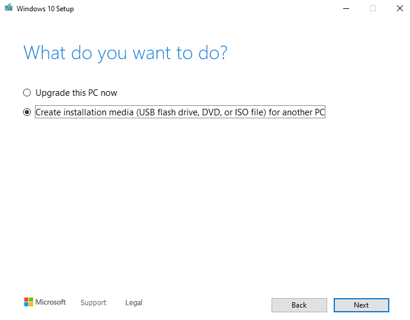
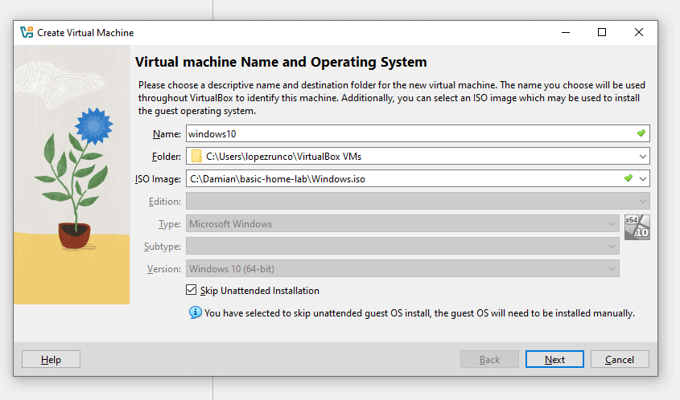
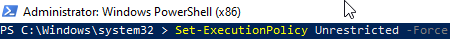
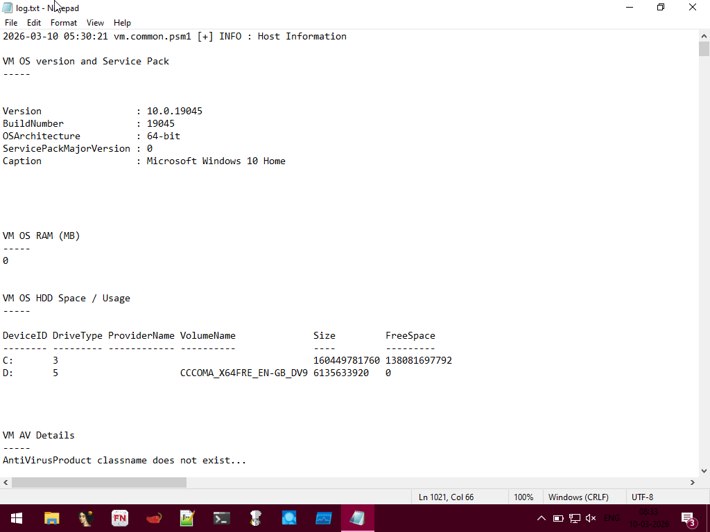
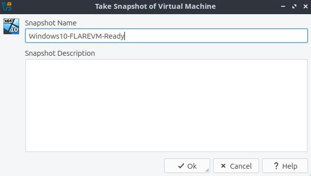
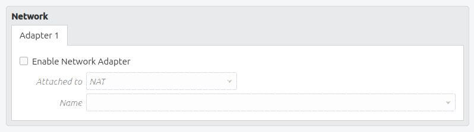
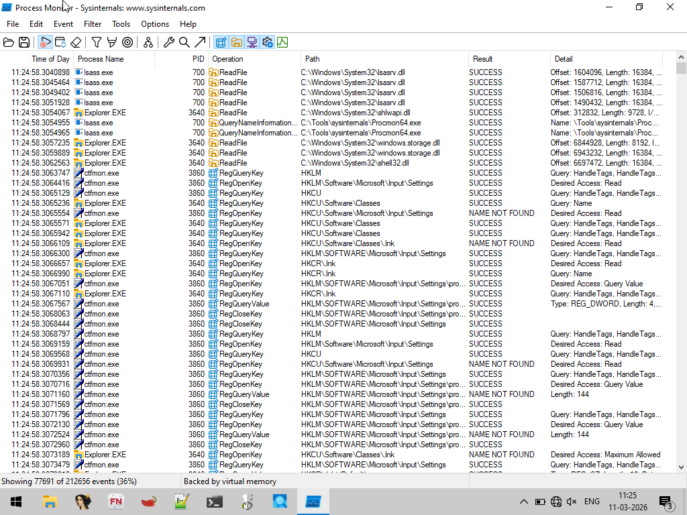

# Malware Analysis Lab
> A step-by-step guide to setting up FLARE VM for malware analysis.

## Tools Used

[](https://www.virtualbox.org/)  
[](https://www.microsoft.com/en-ca/software-download/windows10)  
[](https://github.com/mandiant/flare-vm)  
[](https://github.com/ionuttbara/windows-defender-remover)

## Prerequisites

- VirtualBox (6.1 or newer) installed

## Contents

- [Install Windows 10 VM](#install-windows-10-vm)
- [Disable Windows Defender](#disable-windows-defender)
- [Install FLARE VM](#install-flare-vm)
- [Isolate the VM](#isolate-the-vm)

## Install Windows 10 VM

Go to [this link](https://www.microsoft.com/en-ca/software-download/windows10), scroll down to the **Create Windows 10 installation media** section and click **Download now**. This will download the Media Creation Tool, which will help us create the Windows 10 image file.

Once you run the tool, on the **What do you want to do?** screen, select **Create installation media**, then choose **ISO file**.



After downloading the Windows 10 ISO file, open VirtualBox and create your first VM.

Click **New** to open the **Create VM** wizard. Name the VM `Windows10`, select the ISO image, and check **Skip unattended installation** — This allows manual installation.

Click **Next** to review the VM specifications.



To later install `FLARE VM` inside a Windows 10 VM, the recommended specifications for reverse engineering and dynamic malware analysis are:

- RAM: 8 GB
- CPU: 4 vCPUs
- Disk: 80–100 GB

Set RAM, CPU, and disk according to the recommended specifications, then click **Next**.

Next, the wizard will show a summary of your VM settings. If everything looks good, click **Finish**.

To start your Windows 10 VM, simply click **Start** and follow the installation instructions.

## Disable Windows Defender

Once our Windows 10 VM is installed, we need to make some adjustments in order to analyze malware without interruptions and in a controlled environment.

To shorten the process of disabling Windows Defender, I will use the `windows-defender-remover` tool by **ionuttbara**.  
First, disable some Windows security features to prevent this tool from being blocked.

Go to **Windows Settings → Privacy & Security → Virus & Threat Protection**

Once there, disable:

- Real-time protection
- Cloud-based protection
- Automatically send samples
- Tamper protection

If any Windows warning appears, just bypass it and continue.

Once these settings are disabled, go to the Windows Defender Remover repository (https://github.com/ionuttbara/windows-defender-remover) and download the `DefenderRemover.exe` file.

The browser might trigger an alert warning about a suspicious file; just click on `Keep the file`.

As Windows Defender is a protected system service, elevated privileges are needed to disable it completely. So, once the file is downloaded, right-click `DefenderRemover.exe` and select **Run as Administrator**. 
You will see another dangerous file warning — just click `Execute anyway`.

After that, `WindowsDefenderRemover` will finally run. A console will prompt you with several options; simply select the first one by pressing `Y`, and the tool will do its work.

Once it finishes, it will ask you to reboot the system. Just accept it.

**Windows Defender** has been disabled.

Now is a good time to take a snapshot of the VM. That way, you will have a restore point if anything goes wrong in the next step.

## Install FLARE VM

FLARE VM is a freely available Windows-based security distribution designed for reverse engineering and malware analysis. Developed by Mandiant (now part of Google Cloud), it is essentially a collection of software installation scripts that transform a standard Windows installation into a comprehensive workstation for security professionals.

First, we need to tell the system to temporarily allow the execution of scripts. This allow the FLARE VM installer to run without being blocked by Windows security policies. Open a PowerShell console and execute this command:

```powershell
Set-ExecutionPolicy Unrestricted -Force
```

This allows the FLARE VM installer to run scripts without restriction.



Now, let's download the FLARE VM installer by running the following command:

```powershell
(New-Object Net.WebClient).DownloadFile("https://raw.githubusercontent.com/mandiant/flare-vm/main/install.ps1","$env:USERPROFILE\Desktop\install.ps1")
```

Next, navigate to the location of the installer and execute it:

```powershell
cd $env:USERPROFILE\Desktop
.\install.ps1
```

FLARE VM will install over 200 malware analysis and reverse engineering tools. 
These tools include disassemblers, debuggers, network analyzers and malware sandboxing frameworks. Installing them all at once ensures a comprehensive environment for both static and dynamic analysis.

This process can take around 3 hours depending on your network connection. The VM will reboot multiple times; allow it to continue. If any services require a password, provide one and save it for later.

Once finished, the console will automatically close and the `log.txt` file will open. Go through it to check for any installation errors.



Done! Our malware analysis lab is ready, but before downloading any malware, we need to take some precautions. For now, take another snapshot of the VM.



## Isolate the VM

Since we will be working with malware samples, it is important to isolate the VM to prevent any possible infection of our host OS.

In my case, I am using Linux Lubuntu, so it is not very common to encounter Linux malware targeting my host OS. However, it is still better to take all the necessary precautions.

### Isolate the VM Network

Malware often tries to reach the internet to download payloads, communicate with C2 servers, or exfiltrate data. To prevent this, go to the VirtualBox Manager, select the FLARE VM, and open **Settings**.

In the **Network** tab, select **Internal Network**. This way, the VM is isolated from both the host and the internet.

Another safer option is to disable the adapter entirely, but this means we will not have network access for analysis. Be aware that some malware may not run if it expects internet connectivity.



### Disable Shared Clipboard & Drag and Drop

These features are convenient but dangerous when analyzing malware. If they are enabled, malware could read or copy your host clipboard or drop files onto your host system.

To disable them, select the FLARE VM and then:

1. Open **Settings** for the FLARE VM.
2. Go to **User Interface → Devices**.
3. Set **Shared Clipboard** → `Disabled`.
4. Set **Drag and Drop** → `Disabled`.

### Disable Shared Folders

If a malware sample can access them, your host system is exposed. Select the FLARE VM and go to:

1. Open **Settings** for the FLARE VM.
2. Go to **Shared Folders**.
3. Remove any existing shared folders.

After configuring these settings, we are ready to analyze malware!



## Conclusion

I created this lab as part of my journey into cybersecurity, with a particular focus on malware analysis — a field that fascinates me.

Setting up and using this lab helps me build practical skills, understand malware behavior in depth, and prepare for more advanced research and professional work in cybersecurity.

## Skills Demonstrated

- Windows VM setup and management for secure testing
- PowerShell scripting and execution policy configuration
- Malware lab network isolation and security practices
- Installation and usage of FLARE VM tools (disassemblers, debuggers, sandboxing frameworks)
- Risk mitigation through snapshots and controlled environment
- Analytical thinking and documentation for technical workflows